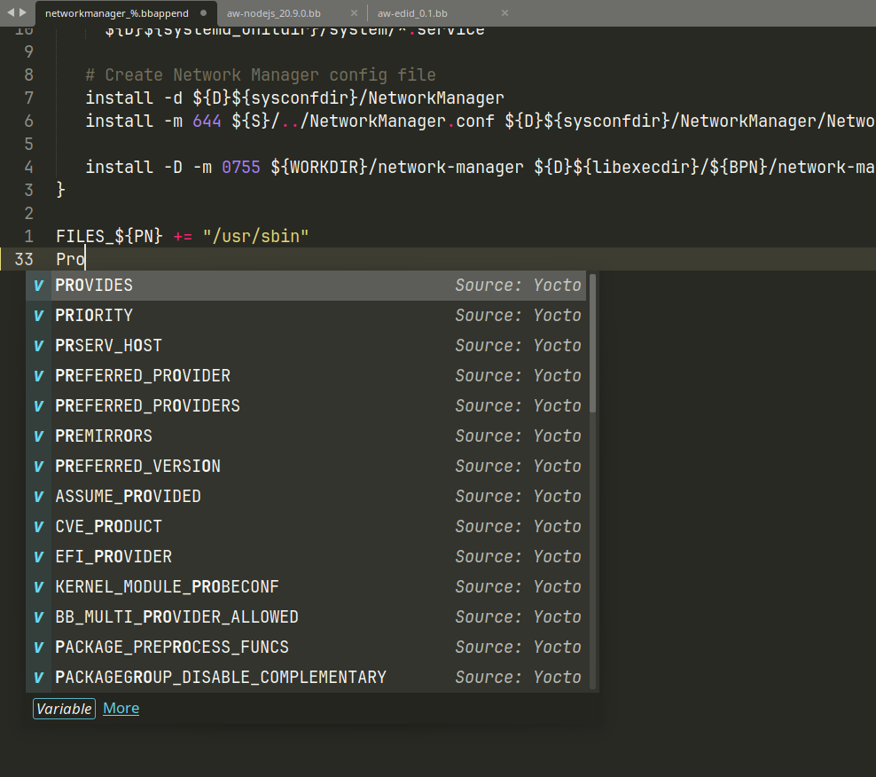

# LSP-bitbake

Bitbake support for Sublime's LSP plugin provided through [VS Code's Bitbake language server](https://github.com/yoctoproject/vscode-bitbake/tree/staging/server) extension.

# Installation
- Install `LSP` and `LSP-bitbake` from Package Control. For syntax highlighting, install [Bitbake-Syntax](https://github.com/huyhoang8398/BitBake-Syntax)
- Restart Sublime

# Configuration
Open configuration file using command palette with `Preferences: LSP-bitbake Settings` command or opening it from the Sublime menu.
